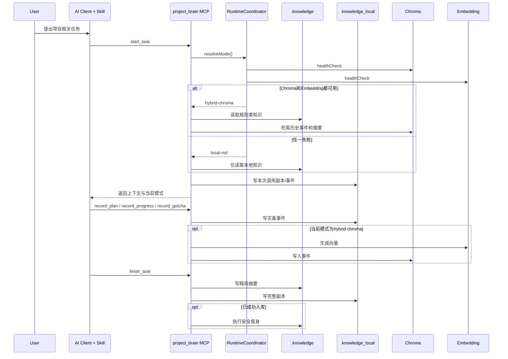
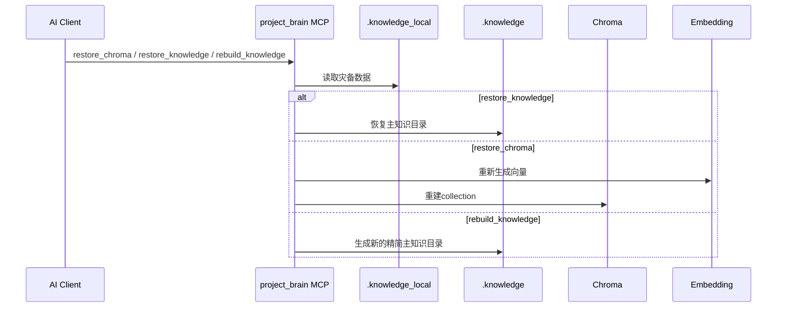

# project_brain + Chroma 设计方案

## 实施说明

- 本文档是 Chroma 改造的设计基线文档。
- 具体实施顺序、完成状态和勾选进度以 `docs/chroma/chroma_plan.md` 为准。
- 首批实施范围仅包含 `local-md` 与 `hybrid-chroma` 两种模式，不包含 `chroma-only`。
- 首期明确不做：完整模型上下文全量入库、复杂权限系统、多数据库适配层。

## 1. 背景

`project_brain` 当前把知识沉淀全部保存在仓库内的 Markdown 文件：

- 根 `AGENTS.md`
- `.knowledge/global/AGENTS.md`
- `.knowledge/modules/*/*.md`
- `.knowledge/tasks/*.md`

当前模式的优点是可读、可审计、易迁移，但也有明显问题：

1. `.knowledge/tasks` 和模块 `AGENTS.md` 会越来越大。
2. 沉淀粒度偏粗，主要只有 `start_task` 和 `finish_task` 两个关键点。
3. 没有过程型知识的结构化存储能力。
4. 一旦未来引入向量数据库，如果没有可靠降级和灾备，会把知识资产暴露给外部依赖风险。

本次设计目标是在保持仓库可审计性的前提下，引入 Chroma 与 embedding 能力，同时补齐以下要求：

1. embedding 配置缺失或探测失败时，必须退回 `local-md`。
2. Chroma 可用时，允许对历史本地沉淀做补录、归纳和本地瘦身。
3. 评估“模型上下文”是否值得入库，并给出推荐方案。
4. 每次调用 MCP 时，都必须保留 `.knowledge_local` 作为只写不读的灾备副本，并提供恢复能力。

## 2. 结论摘要

建议采用四层架构：

1. 主工作知识层：`.knowledge`
2. 灾备镜像层：`.knowledge_local`
3. 向量检索层：`Chroma`
4. 可选 embedding 服务层：外部 embedding endpoint

关键结论如下：

1. 对外仍保留两种主模式：
`local-md`
`hybrid-chroma`

2. `hybrid-chroma` 只有在下面两个条件同时成立时才能启用：
- Chroma 可连接
- embedding 模型配置完整且健康检查通过

3. 任何时候只要 Chroma 或 embedding 任一异常，当前调用立即降级为 `local-md`。

4. 无论当前是否启用 `hybrid-chroma`，每次调用都必须同步维护 `.knowledge_local` 灾备副本。

5. `.knowledge_local` 默认不参与读取，只在恢复、重建、补录时使用。

6. Chroma 可用时，系统应支持扫描历史 `.knowledge` / `.knowledge_local`，将可向量化内容补录入库，并在成功归纳后自动精简 `.knowledge` 中的大文本。

## 3. 为什么需要 embedding 门控

上一个版本里提到 Chroma 更适合承接增长型知识，但你指出了一个关键现实问题：

- 如果没有 embedding 模型，或者 embedding 服务不稳定，很多“归纳、相似检索、自动压缩”的价值都无法成立。

这个判断是对的，所以本次方案明确把 `embedding` 从“可选增强”提升为 `hybrid-chroma` 的启用前提之一。

### 3.1 `hybrid-chroma` 启用条件

建议定义为：

1. `PROJECT_BRAIN_STORE_MODE=hybrid-chroma`
2. `PROJECT_BRAIN_CHROMA_URL` 已配置
3. embedding 配置完整
4. Chroma 健康检查通过
5. embedding 健康检查通过

只要任一条件不满足：

- 不报致命错误
- 当前任务自动切回 `local-md`
- 在工具返回文本中明确说明当前已降级

### 3.2 建议新增配置

```text
PROJECT_BRAIN_STORE_MODE=local-md | hybrid-chroma
PROJECT_BRAIN_CHROMA_URL=http://192.168.6.93:8999
PROJECT_BRAIN_CHROMA_NAMESPACE=project-brain
PROJECT_BRAIN_CHROMA_TIMEOUT_MS=3000

PROJECT_BRAIN_EMBEDDING_PROVIDER=openai-compatible | ollama | custom
PROJECT_BRAIN_EMBEDDING_URL=http://host:port/v1/embeddings
PROJECT_BRAIN_EMBEDDING_MODEL=text-embedding-3-large
PROJECT_BRAIN_EMBEDDING_API_KEY=***
PROJECT_BRAIN_EMBEDDING_TIMEOUT_MS=5000
```

说明：

- provider 只是帮助封装请求，不决定架构。
- 如果 URL、model 等关键配置缺失，则直接不启用 `hybrid-chroma`。
- 如果 embedding 接口连通但返回异常结构，也视为探测失败。

### 3.3 建议的健康检查策略

启动时和运行时都做检查，但职责不同：

1. 启动时：
- 读取配置
- 进行一次轻量健康检查
- 确定默认运行模式

2. 每次任务调用时：
- 做一次快速缓存校验
- 如果距离上次成功检查超过阈值，例如 60 秒，再做一次轻探测

3. 真正写 Chroma 前：
- 如果当前状态不确定，再做一次最终确认

建议使用双状态：

- `AVAILABLE`
- `DEGRADED`

并记录降级原因：

- `MISSING_EMBEDDING_CONFIG`
- `EMBEDDING_UNHEALTHY`
- `CHROMA_UNHEALTHY`
- `NETWORK_TIMEOUT`

## 4. 模式定义调整

### 4.1 `local-md`

完全本地模式：

- 只读写 `.knowledge`
- 同步写 `.knowledge_local`
- 不依赖 Chroma
- 不依赖 embedding

### 4.2 `hybrid-chroma`

增强模式：

- 规则类知识仍读 `.knowledge`
- 过程类和向量化知识进入 Chroma
- 同步写 `.knowledge_local`
- 允许对 `.knowledge` 进行“归纳后瘦身”

### 4.3 为什么仍不建议 `chroma-only`

即使引入 embedding，也不建议纯 Chroma：

1. `get_file` 语义会被破坏。
2. Git 审核会失去主要对象。
3. 仓库不再自包含。
4. 数据库被误删或切换时，恢复成本过高。

所以最终结构应当是：

- `.knowledge`：当前生效规则 + 精简摘要
- `.knowledge_local`：完整灾备副本
- `Chroma`：结构化事件 + 向量索引 + 归纳摘要

## 5. 三层知识存储职责

### 5.1 `.knowledge`

职责：

- 当前有效规则
- 当前有效模块知识
- 精简任务摘要
- 紧凑型人工可读文档

特点：

- 参与日常读取
- 保持简洁
- 可 Git diff

### 5.2 `.knowledge_local`

职责：

- 每次调用后的本地完整副本
- Chroma 灾备源
- `.knowledge` 恢复源
- 重新建库时的原始素材

特点：

- 默认不参与日常读取
- 不做自动归纳替换
- 尽量保留原始详细文本

### 5.3 `Chroma`

职责：

- 过程型知识存储
- 历史任务事件存储
- 向量索引
- 自动归纳结果存储

特点：

- 只在可用时参与
- 允许高频增长
- 可用 metadata 检索，也可用 embedding 检索

## 6. 当 Chroma 可用时，如何精简本地 Markdown

这部分是本次设计的核心升级点：不是简单“写一份到 Chroma”，而是“写入成功后，允许精简本地主知识库”，但前提是有灾备副本。

### 6.1 精简原则

只有满足下面条件的内容，才允许从 `.knowledge` 主文件中被缩短：

1. 原文已经完整写入 `.knowledge_local`
2. 原文已经成功入库 Chroma
3. 已有可读的归纳摘要
4. 可通过引用信息重新定位原文

如果任一步失败，则 `.knowledge` 不做精简。

### 6.2 哪些内容可以精简

优先级建议如下：

1. `.knowledge/tasks/*.md` 中的大段过程记录
2. 模块 `AGENTS.md` 中累积过长的 Change Log / gotcha 段落
3. 后续新增的 `record_progress`、`record_gotcha` 形成的历史事件

### 6.3 哪些内容不要精简

- 根 `AGENTS.md`
- `.knowledge/global/AGENTS.md`
- 模块 `SPEC.md`
- 模块 `api.md` / `DESIGN.md`
- 当前仍被频繁直接读取的关键规则段

### 6.4 精简后的写法建议

不要直接删除，而是改成“摘要 + 引用”：

```md
## 历史详细记录
- 本段详细过程已归档至 Chroma
- archive_ref: task_session_id=...
- backup_ref: .knowledge_local/tasks/xxx.md
- summary: ...
```

这样：

- `.knowledge` 保持简洁
- `.knowledge_local` 保留原文
- Chroma 保留检索能力

## 7. 自动补录与自动瘦身机制

你提到一个很关键的混合场景：

- 网络有时可用，有时不可用
- 某些调用落在 `local-md`
- 等恢复后，需要把历史沉淀补进 Chroma

这意味着 `hybrid-chroma` 不能只处理“当前写入”，还要处理“历史追补”。

### 7.1 需要新增的后台概念

建议引入两个概念：

1. `ingestion`
2. `compaction`

定义：

- `ingestion`：把 `.knowledge` / `.knowledge_local` 中尚未入库的内容写入 Chroma
- `compaction`：在确认已安全入库后，精简 `.knowledge` 中的长文本

### 7.2 入库状态跟踪

为了知道哪些内容已经入库，建议引入 manifest 文件：

- `.knowledge/ingestion_manifest.json`
- `.knowledge_local/ingestion_manifest.json`

每条记录至少包含：

```json
{
  "source_file": ".knowledge/tasks/2026-04-30-xxx.md",
  "content_hash": "sha256:...",
  "task_session_id": "uuid",
  "ingested": true,
  "compacted": false,
  "chroma_doc_ids": ["..."],
  "last_ingested_at": "2026-04-30T11:00:00"
}
```

### 7.3 自动补录触发时机

建议有三种触发方式：

1. 每次任务开始时轻量检查
2. 每次从 `DEGRADED` 恢复到 `AVAILABLE` 时触发
3. 通过显式工具手动触发

### 7.4 自动补录流程

推荐流程：

1. 扫描 `.knowledge` 和 `.knowledge_local`
2. 根据 manifest 找出未入库内容
3. 对可向量化内容切 chunk
4. 调用 embedding
5. 写入 Chroma
6. 更新 manifest
7. 对满足条件的 `.knowledge` 主文件执行精简

### 7.5 自动瘦身流程

推荐只对 `.knowledge` 主目录做瘦身，不改 `.knowledge_local`。

瘦身时机：

- 入库成功后立即执行
- 或由显式任务统一批量执行

瘦身策略：

1. 提取摘要
2. 写入 archive_ref
3. 保留关键决策和结论
4. 移除冗长过程细节

## 8. 模型上下文是否入库

这是一个需要分层回答的问题。

### 8.1 不建议无条件存全部模型上下文

原因：

1. 会快速膨胀
2. 包含大量临时推理、重复表述和低价值对话噪音
3. 可能包含敏感数据
4. 对后续检索的污染很大

所以不建议把“完整对话上下文”原样入库。

### 8.2 推荐存“可复用上下文摘要”

推荐把上下文分为三类：

1. 不存
2. 摘要存
3. 原文灾备存

#### 不存

- 无效尝试
- 临时猜测
- 纯礼貌对话
- 重复表达

#### 摘要存

- 用户明确需求
- 边界约束
- 决策理由
- 验收标准
- 稳定 gotcha
- 关键上下文结论

#### 原文灾备存

- 与任务结果强绑定的关键上下文
- 对恢复任务链有价值的原始文本

原文灾备应优先写到 `.knowledge_local`，而不是直接进入 Chroma 主检索空间。

### 8.3 推荐的实现方式

建议新增上下文条目类型：

- `task_context_snapshot`
- `task_context_summary`

存储策略：

1. `task_context_summary`
- 写入 Chroma
- 参与检索

2. `task_context_snapshot`
- 写入 `.knowledge_local`
- 默认不参与日常读取

### 8.4 推荐计划

分两期做：

#### 第一期

- 不存完整模型上下文
- 只在 `start_task`、`record_plan`、`finish_task` 提取结构化上下文摘要

#### 第二期

- 支持将关键上下文快照写入 `.knowledge_local/context/`
- 只在用户明确允许或规则明确时写入

## 9. 灾备设计：`.knowledge_local`

你提出的这个要求是必须成立的，而且我认同：

- 如果数据库切换了
- 如果 Chroma 被误删了
- 如果有人恶意清库了

之前沉淀的知识不能丢。

所以本次方案将 `.knowledge_local` 定义为强制灾备层，而不是可选功能。

### 9.1 `.knowledge_local` 的定位

`.knowledge_local` 是项目级本地副本，目标是：

1. 保留完整沉淀
2. 不依赖外部服务
3. 支持重建 `.knowledge`
4. 支持重建 Chroma

### 9.2 为什么默认不读 `.knowledge_local`

如果日常也读取 `.knowledge_local`，会出现两个问题：

1. 它会重新把上下文拖大
2. 会让“当前有效知识”和“灾备原始知识”边界不清

所以默认策略应为：

- 日常只读 `.knowledge`
- 恢复或补录时才读 `.knowledge_local`

### 9.3 每次调用都要同步写副本

本条是强约束：

- 每次 `init_project`
- 每次 `start_task`
- 每次 `record_plan`
- 每次 `record_progress`
- 每次 `record_gotcha`
- 每次 `finish_task`

都要同步更新 `.knowledge_local`

写入策略建议为：

1. 对 `.knowledge` 的正式文件改动，复制一份完整副本到 `.knowledge_local`
2. 对过程事件，优先直接写入 `.knowledge_local/events/`
3. 对上下文快照，写入 `.knowledge_local/context/`

### 9.4 目录建议

```text
.knowledge_local/
  global/
  modules/
  tasks/
  events/
  context/
  restore/
  ingestion_manifest.json
```

## 10. 恢复与重建能力

这部分必须提供明确 API，而不是只靠人工脚本。

### 10.1 建议新增工具

在保留现有工具的基础上，建议新增：

1. `record_plan`
2. `record_progress`
3. `record_gotcha`
4. `sync_to_chroma`
5. `compact_knowledge`
6. `restore_knowledge`
7. `restore_chroma`
8. `rebuild_knowledge`

其中后四个是这次新增的恢复和同步能力。

### 10.2 `sync_to_chroma`

用途：

- 扫描 `.knowledge` 与 `.knowledge_local`
- 对未入库内容执行补录
- 更新 manifest

适合：

- 网络恢复后手动补录
- 首次接入 Chroma 后批量入库历史数据

### 10.3 `compact_knowledge`

用途：

- 对已成功归档到 Chroma 的 `.knowledge` 内容执行精简

安全前提：

- `.knowledge_local` 已存在原文
- Chroma 已确认写入成功

### 10.4 `restore_knowledge`

用途：

- 从 `.knowledge_local` 恢复 `.knowledge`

适合：

- `.knowledge` 被误删
- `.knowledge` 被错误瘦身
- 需要从灾备回滚

### 10.5 `restore_chroma`

用途：

- 从 `.knowledge_local` 重建 Chroma 数据

适合：

- Chroma 换库
- Chroma 数据被删除
- namespace 重建

### 10.6 `rebuild_knowledge`

用途：

- 从 `.knowledge_local` + Chroma 重新生成当前 `.knowledge`

适合：

- 希望重建一个更紧凑的主知识目录
- 做过多次 compaction 后希望重新整理主知识库

## 11. 存储抽象升级

建议把原来单一的 `KnowledgeStore` 扩展成更清晰的多组件设计。

### 11.1 建议抽象

```java
public interface PrimaryKnowledgeStore {
    StartTaskContext loadStartContext(Path projectRoot, String taskDescription) throws IOException;
    List<ModuleInfo> listModules(Path projectRoot) throws IOException;
    FinishTaskResult finishTask(FinishTaskCommand command) throws IOException;
}

public interface BackupKnowledgeStore {
    void snapshotKnowledge(Path projectRoot) throws IOException;
    void appendEvent(BackupEvent event) throws IOException;
    void writeContextSnapshot(ContextSnapshot snapshot) throws IOException;
}

public interface VectorKnowledgeStore {
    StoreHealth health();
    IngestionResult ingest(IngestionBatch batch) throws IOException;
    QueryResult query(QueryRequest request) throws IOException;
    RestoreResult rebuildFromBackup(Path projectRoot) throws IOException;
}
```

### 11.2 调度层

建议新增编排器：

- `KnowledgeRuntimeCoordinator`

负责：

1. 决定当前使用 `local-md` 还是 `hybrid-chroma`
2. 调用 `.knowledge_local` 灾备写入
3. 处理 ingest / compact / restore 流程

## 12. Chroma 数据设计

### 12.1 collection 划分

建议至少拆为四类：

1. `pb_knowledge_events`
2. `pb_knowledge_summaries`
3. `pb_task_context_summaries`
4. `pb_compaction_records`

### 12.2 metadata 建议

```json
{
  "project_path": "F:\\McpProjects\\project_brain",
  "project_name": "project_brain",
  "module": "knowledge",
  "stage": "start|plan|progress|gotcha|finish|summary|context",
  "task_session_id": "uuid",
  "source_file": ".knowledge/tasks/2026-04-30-xxx.md",
  "backup_file": ".knowledge_local/tasks/2026-04-30-xxx.md",
  "content_hash": "sha256:...",
  "stable": true,
  "compacted": false,
  "created_at": "2026-04-30T10:00:00"
}
```

### 12.3 compaction 记录

每次精简本地文件后，都建议写一条 compaction record：

- 原始文件
- 原始 hash
- 归纳摘要
- 对应 Chroma doc id
- 对应 backup 路径

这样后续恢复时可以追溯。

## 13. MCP 调用链

### 13.1 日常任务调用链



### 13.2 恢复调用链



## 14. skill 方案调整

`project-brain-workflow` skill 仍然需要，但要补充新规则：

1. 任务开始时优先调用 `start_task`
2. 读取返回结果中的 `store_mode` 和 `store_status`
3. 如果当前是 `DEGRADED`，不要假设 Chroma 一定可用
4. 在需要历史补录或灾备恢复时，调用：
- `sync_to_chroma`
- `restore_knowledge`
- `restore_chroma`
- `rebuild_knowledge`

skill 的职责仍然只是约束调用顺序，不承担存储细节。

## 15. 代码改造落点

### 15.1 `knowledge` 模块

新增重点：

- `EmbeddingClient`
- `ChromaClient`
- `StoreHealthChecker`
- `BackupKnowledgeStore`
- `CompactionService`
- `IngestionService`
- `RestoreService`
- `KnowledgeRuntimeCoordinator`

### 15.2 `tools` 模块

新增工具：

- `RecordPlanTool`
- `RecordProgressTool`
- `RecordGotchaTool`
- `SyncToChromaTool`
- `CompactKnowledgeTool`
- `RestoreKnowledgeTool`
- `RestoreChromaTool`
- `RebuildKnowledgeTool`

### 15.3 `server` 模块

更新点：

- `BrainServer.tools` 注册新工具
- `instructions` 补充降级模式、灾备和恢复流程说明

### 15.4 `template` 模块

更新点：

- 根 `AGENTS.md` 模板补充“默认维护 `.knowledge_local` 灾备副本”
- `tasks/README.md` 增加“主目录可能被精简，完整原始记录在 `.knowledge_local`”

## 16. 实施顺序建议

建议拆成四阶段。

### 阶段一：引入灾备，不改对外行为

目标：

- 每次调用同步维护 `.knowledge_local`
- 新增 backup manifest

收益：

- 先解决“数据不能丢”的根问题

### 阶段二：引入 embedding 门控和运行时降级

目标：

- 配置 embedding
- 健康检查
- `hybrid-chroma` 只在双健康时启用

收益：

- 真正把 Chroma 从“可配”变成“可控”

### 阶段三：引入补录与瘦身

目标：

- `sync_to_chroma`
- `compact_knowledge`
- manifest 驱动的补录和精简

收益：

- 开始解决 `.knowledge` 越来越大的问题

### 阶段四：引入上下文摘要入库

目标：

- 只沉淀结构化上下文摘要
- 视需要增加 `.knowledge_local/context` 快照

收益：

- 提升后续任务的上下文召回质量

## 17. 风险与约束

1. embedding 服务不稳定时，不能强行使用 `hybrid-chroma`。

2. compaction 必须晚于：
- `.knowledge_local` 备份成功
- Chroma 入库成功
- 引用元数据写入成功

3. 不要把完整模型上下文默认塞进 Chroma。

4. `.knowledge_local` 是恢复源，不应该参与日常读取。

5. 如果未来切换数据库，恢复入口必须优先从 `.knowledge_local` 重建，而不是依赖旧库导出。

## 18. 最终建议

最终推荐的稳定方案是：

1. `project_brain` 对外仍提供 `local-md` 和 `hybrid-chroma` 两种主模式。
2. `hybrid-chroma` 必须以“Chroma 可用 + embedding 可用”为前提。
3. 任一依赖失败，立即降级到 `local-md`。
4. 每次调用都同步维护 `.knowledge_local`，作为强制灾备副本。
5. Chroma 恢复可用后，支持扫描历史 `.knowledge` / `.knowledge_local` 做补录。
6. 在确认备份和入库成功后，允许自动精简 `.knowledge` 的大文本。
7. 模型上下文不建议全量入库，只建议提炼成结构化摘要入库，原始快照按需保存在 `.knowledge_local`。

按这条路线推进后，`project_brain` 会从“基于 Markdown 的知识文件工具”升级成“主知识目录 + 灾备目录 + 向量知识库”的三层知识系统，同时具备降级、恢复、补录和精简能力。
